# ONG CHADIA — Document d'Architecture Technique

> Version 1.0 · Basé sur PRD v1.0 · Projet : web-chadia

---

## Table des matières

1. [Vue d'ensemble du système](#1-vue-densemble-du-système)
2. [Architecture des pages et routing](#2-architecture-des-pages-et-routing)
3. [Data Abstraction Layer](#3-data-abstraction-layer)
4. [Flux du formulaire de contact](#4-flux-du-formulaire-de-contact)
5. [Pipeline CI/CD et déploiement](#5-pipeline-cicd-et-déploiement)
6. [Migration V1 → V2](#6-migration-v1--v2)
7. [Décisions architecturales clés](#7-décisions-architecturales-clés)

---

## 1. Vue d'ensemble du système

Ce diagramme montre les composants principaux du système et comment ils communiquent entre eux.

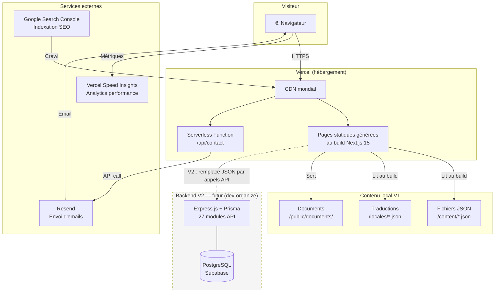

**Légende :**
- Trait plein → flux V1 actuel
- Trait pointillé → évolution prévue en V2
- Le CDN Vercel sert les pages statiques depuis le serveur le plus proche du visiteur

---

## 2. Architecture des pages et routing

### 2.1 Arbre complet des routes

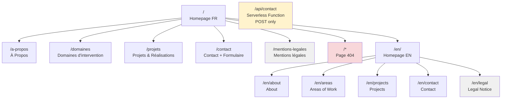

**Notes :**
- Pages grisées → `noindex` (ne pas indexer sur Google)
- Page jaune → Serverless Function, pas une page affichée
- La page 404 (`not-found.tsx`) intercepte toutes les routes non trouvées

### 2.2 Middleware de routing i18n

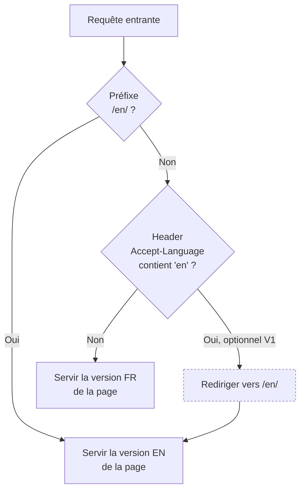

**Note :** La redirection automatique par `Accept-Language` est optionnelle en V1. La bascule manuelle via le sélecteur suffit au lancement.

### 2.3 Contrôle du sélecteur de langue

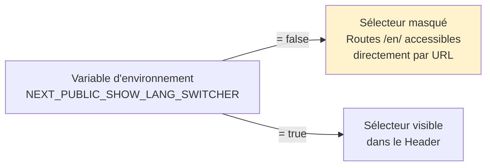

**Pourquoi ?** Permet de livrer l'infrastructure i18n en avance, et d'activer le sélecteur sans re-déployer le code — juste en changeant la variable dans Vercel Dashboard.

---

## 3. Data Abstraction Layer

### 3.1 Principe général

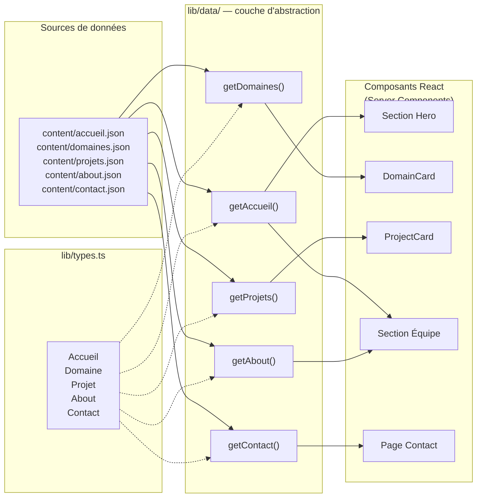

### 3.2 Flux de données au build (SSG)

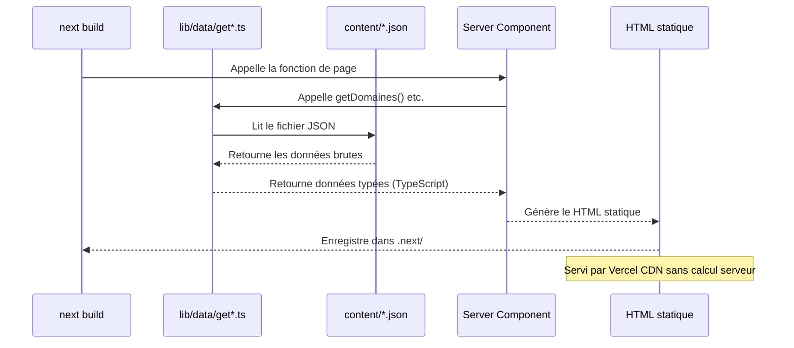

### 3.3 Composant DomainCard — variantes

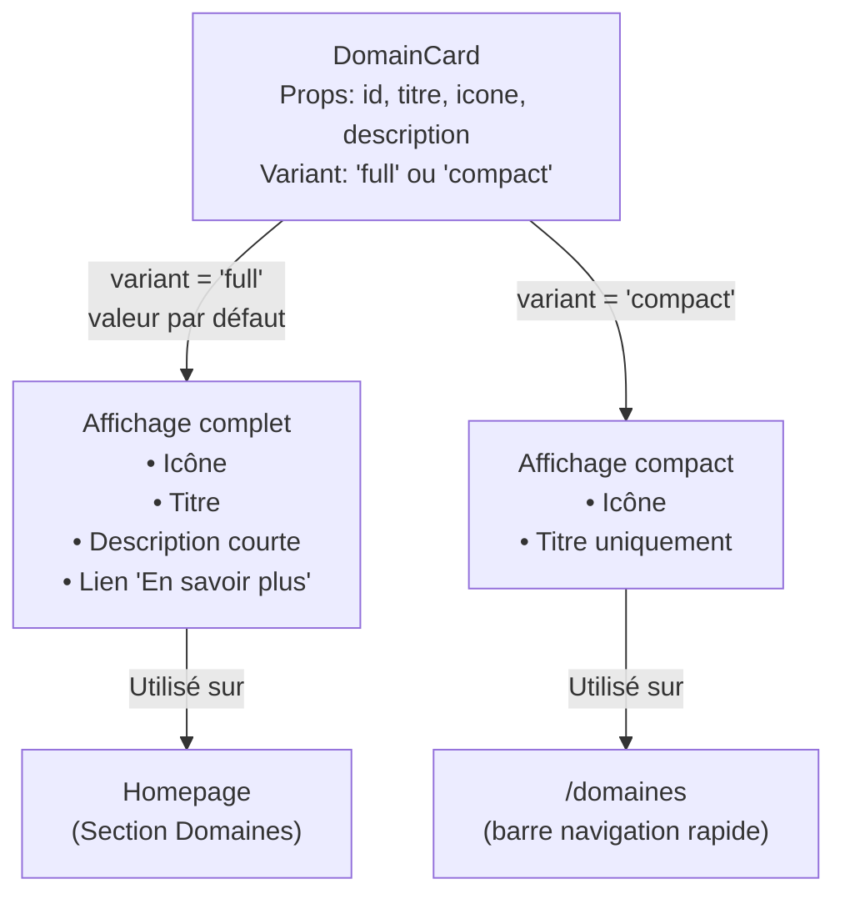

---

## 4. Flux du formulaire de contact

### 4.1 Vue générale

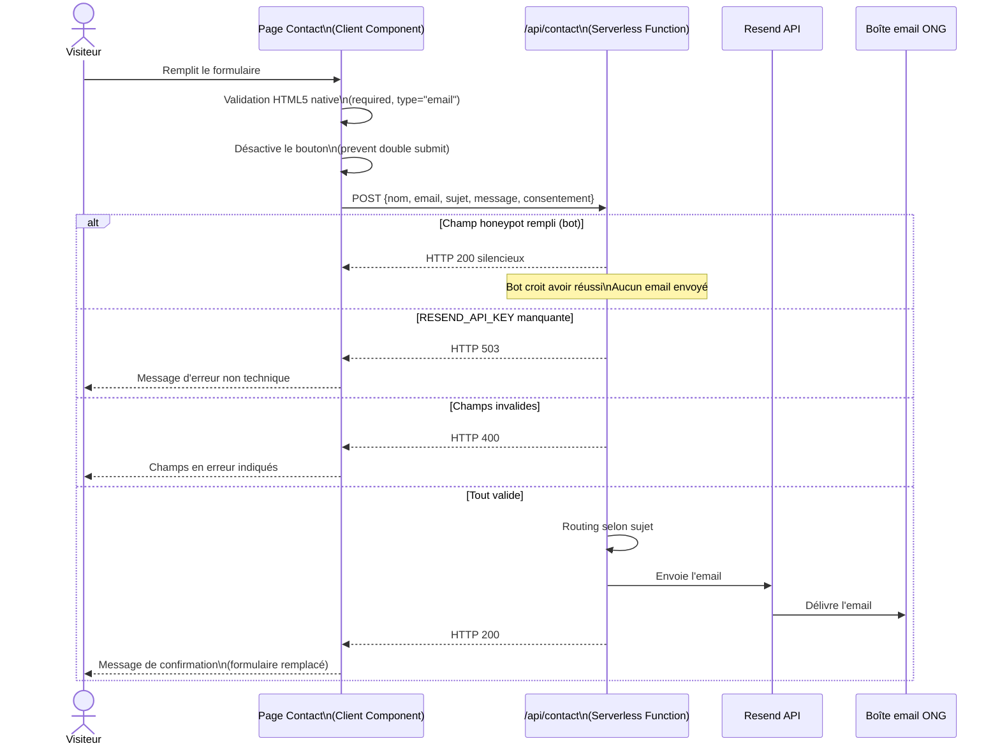

### 4.2 Routing email selon le sujet

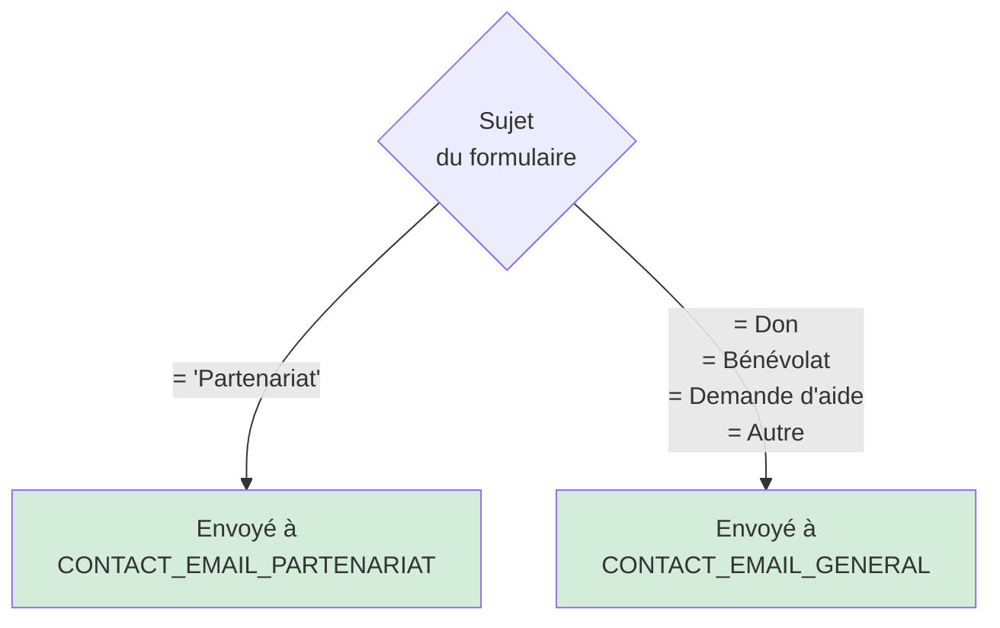

### 4.3 Protection anti-spam (honeypot)

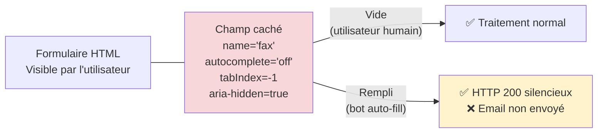

---

## 5. Pipeline CI/CD et déploiement

### 5.1 Flux de déploiement

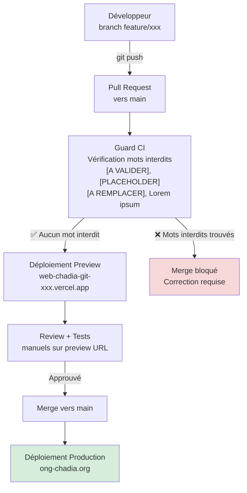

### 5.2 Infrastructure Vercel

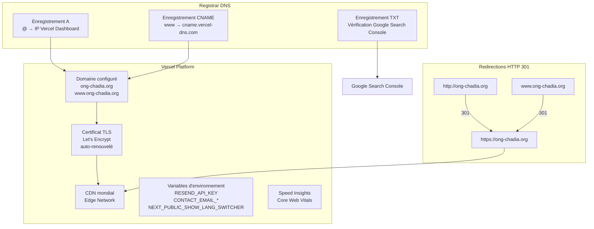

### 5.3 Checklist pré-lancement

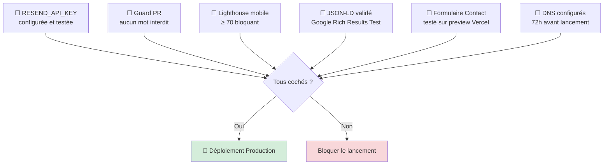

---

## 6. Migration V1 → V2

### 6.1 Principe de la migration

La migration est possible **sans modifier aucun composant React** grâce au Data Abstraction Layer. Seules les fonctions `getData()` changent.

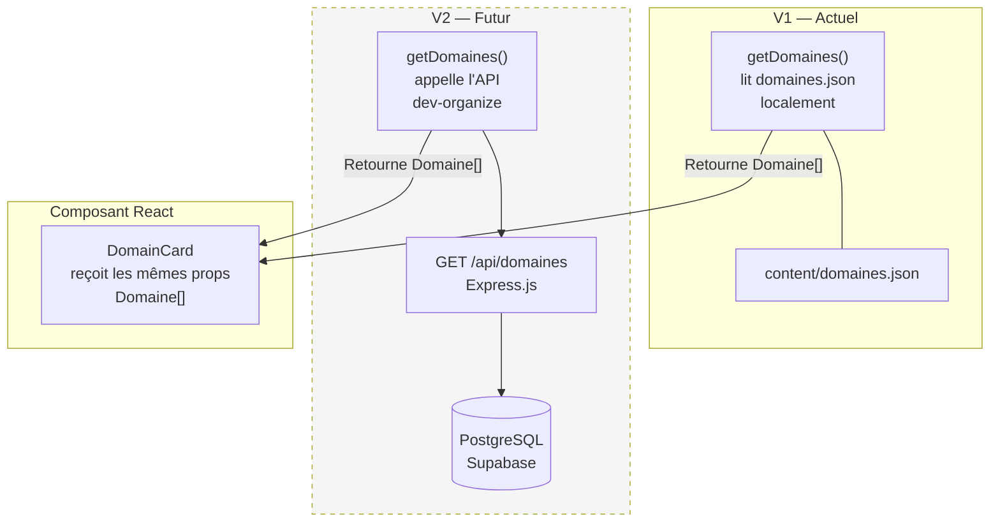

### 6.2 Séquence de migration progressive

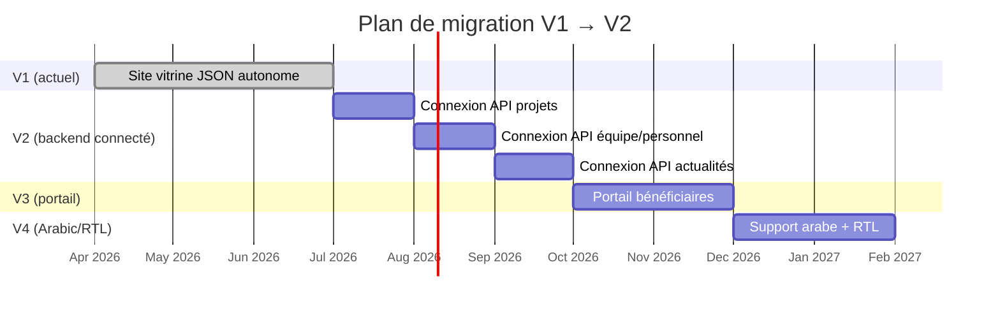

### 6.3 Mapping V1 JSON → V2 API

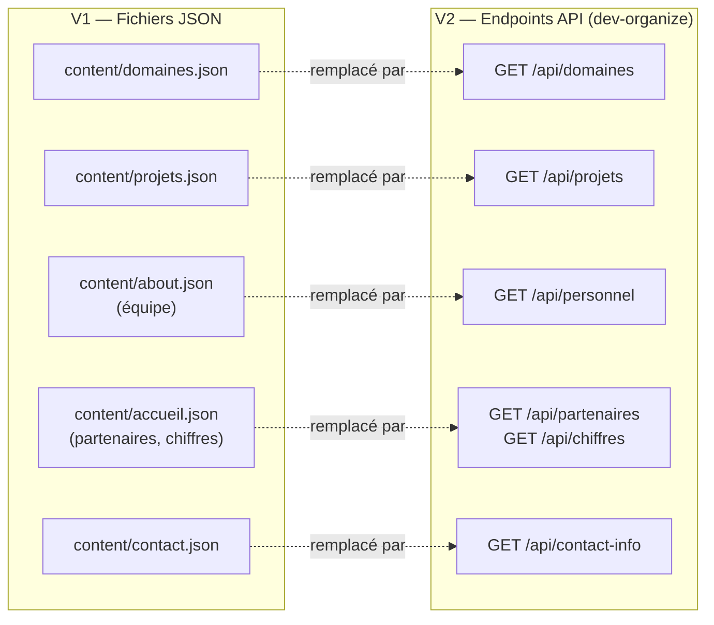

---

## 7. Décisions architecturales clés

### DA-001 — SSG plutôt que SSR

| Critère | SSG ✅ | SSR ❌ |
|---|---|---|
| Performance 3G | Pages servies depuis CDN, 0 calcul serveur | Calcul à chaque requête, latence variable |
| Coût | Gratuit sur Vercel (pages statiques) | Consomme des fonctions serverless |
| Contenu JSON | Intégré au build, pas de fetch client | Inutile — le contenu ne change pas en temps réel |
| V2 migration | getData() abstraite — migration transparente | Même abstraction possible |

**Décision :** SSG pour toutes les pages. Exception unique : `/api/contact` (Serverless Function POST).

---

### DA-002 — Polyrepo plutôt que Monorepo

| Critère | Polyrepo ✅ | Monorepo ❌ |
|---|---|---|
| Indépendance V1 | web-chadia déployable sans dev-organize | Couplage fort dès le départ |
| Complexité | Setup simple pour un junior | Turborepo / nx = apprentissage supplémentaire |
| Migration V2 | Appels API cross-repo propres | Imports directs risqués |

**Décision :** Polyrepo. `web-chadia` et `dev-organize` sont deux dépôts indépendants.

---

### DA-003 — Resend plutôt que SMTP direct

| Critère | Resend ✅ | SMTP ONG ❌ |
|---|---|---|
| Quota gratuit | 3 000 emails/mois | Dépend de l'hébergeur email |
| Délivrabilité | Domaine d'envoi vérifié, anti-spam | Risque de blacklist si non configuré |
| Intégration | API simple, SDK Next.js | Config SMTP complexe pour un junior |

**Décision :** Resend en V1. Migration possible vers SMTP propre en V2 si quota insuffisant.

---

### DA-004 — Contenu EN partiel plutôt que traduction complète en V1

**Problème :** Traduction complète de haute qualité prend du temps et de l'argent. Traduction IA de basse qualité nuit à la crédibilité auprès des bailleurs internationaux.

**Solution :** En V1, seuls les textes d'interface (navigation, boutons, formulaire) sont traduits EN. Les contenus longs (descriptions domaines, projets) restent en français avec un bandeau `"Content available in French only"`. Les routes `/en/` sont fonctionnelles.

**Évolution V2 :** Traduction complète des contenus, possiblement via le backend avec champs bilingues en base de données.

---

### DA-005 — Mentions légales en TSX statique plutôt que JSON

**Problème :** Ajouter `getLegal()` + `legal.json` pour du contenu qui change rarément = sur-engineering.

**Solution :** Page TSX avec contenu en dur, marquée `[A VALIDER par direction]`. Modifiable directement dans le fichier quand le contenu évolue. Effort de création : 30 minutes. Effort de maintenance : négligeable.

---

### DA-006 — Feature Flag pour le sélecteur de langue

**Problème :** La traduction EN n'est pas prête au lancement officiel, mais l'infrastructure i18n doit être en place.

**Solution :** Variable d'environnement `NEXT_PUBLIC_SHOW_LANG_SWITCHER`. Passée à `true` dans Vercel Dashboard sans re-déploiement de code quand la traduction est validée.

---

*Document d'architecture généré le 2026-04-01*
*Basé sur PRD v1.0 — ONG CHADIA · Projet web-chadia*
