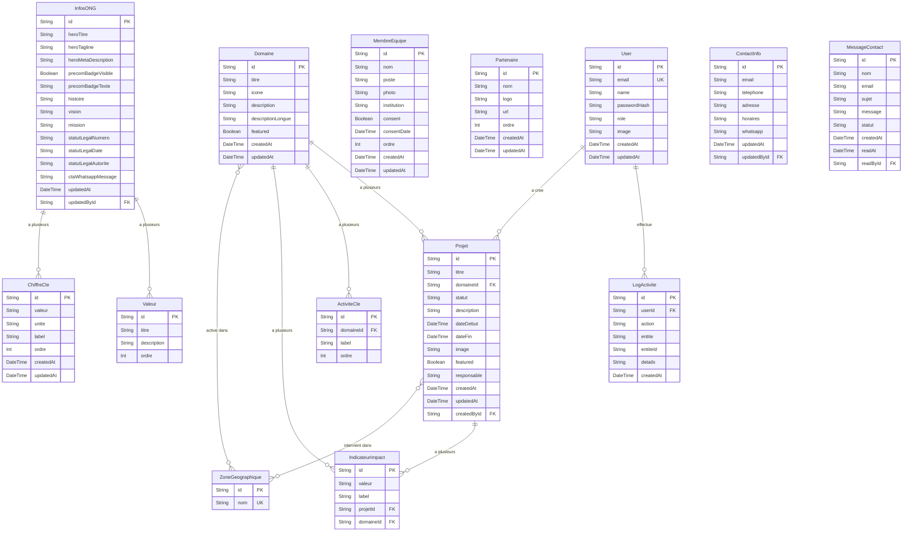

# ONG CHADIA — PRD Back-end

> Powered by BMAD Method · Version 1.0 · Projet : web-chadia-backend

---

## Table des matieres

1. [Objectifs et Contexte](#1-objectifs-et-contexte)
2. [Utilisateurs et Roles](#2-utilisateurs-et-roles)
3. [Modeles de Donnees](#3-modeles-de-donnees)
4. [Endpoints API](#4-endpoints-api)
5. [Panel Admin — Fonctionnalites](#5-panel-admin--fonctionnalites)
6. [Exigences Non-Fonctionnelles](#6-exigences-non-fonctionnelles)
7. [Liste des Epics](#7-liste-des-epics)
8. [Epic 1 — Infrastructure & Fondations](#8-epic-1--infrastructure--fondations)
9. [Epic 2 — Authentification & Gestion des Utilisateurs](#9-epic-2--authentification--gestion-des-utilisateurs)
10. [Epic 3 — API CRUD Contenu](#10-epic-3--api-crud-contenu)
11. [Epic 4 — Panel Admin](#11-epic-4--panel-admin)
12. [Epic 5 — Connexion Front Public + Deploiement](#12-epic-5--connexion-front-public--deploiement)
13. [Plan de Migration V1 vers V2](#13-plan-de-migration-v1-vers-v2)

---

## 1. Objectifs et Contexte

### 1.1 Objectifs

- Remplacer les fichiers JSON statiques du front par une **API dynamique** alimentee par une base de donnees PostgreSQL
- Fournir un **panel d'administration interne** permettant a l'equipe CHADIA de gerer le contenu du site sans toucher au code
- Mettre en place un systeme d'**authentification** avec roles (Super Admin, Admin, Employe) et connexion Google
- Preparer l'architecture pour accueillir le **portail beneficiaires** (V3)

### 1.2 Contexte

Le site vitrine V1 (ong-chadia.com) est deploye sur Vercel avec du contenu statique en JSON. Cette approche a permis un lancement rapide, mais elle presente des limites :

- **Modifier le contenu** necessite de modifier le code et de redeployer
- **Aucune gestion des droits** — n'importe qui avec acces au repo peut tout modifier
- **Pas de tracabilite** — impossible de savoir qui a modifie quoi et quand
- **Pas de validation** — les donnees ne sont pas validees avant d'etre publiees

Le back-end resout ces problemes en centralisant la gestion du contenu dans une interface dediee avec authentification et roles.

### 1.3 Stack Technique

| Brique | Techno | Role |
|--------|--------|------|
| Framework | Next.js 15 (App Router) | API Routes + Panel Admin |
| ORM | Prisma | Acces base de donnees |
| Base de donnees | PostgreSQL | Stockage des donnees |
| Authentification | NextAuth.js (Auth.js v5) | Email/mdp + Google OAuth |
| Hebergement back-end | Railway | API + Admin + PostgreSQL |
| Hebergement front public | Vercel | Site vitrine (existant) |
| Documents | Google Drive | Stockage de fichiers (liens en BDD) |

### 1.4 Architecture Globale

```
┌─────────────────────────┐         ┌─────────────────────────┐
│   FRONT PUBLIC          │         │   BACK-END              │
│   (Next.js — Vercel)    │  HTTP   │   (Next.js — Railway)   │
│   ong-chadia.com        │ ──────→ │                         │
│                         │         │   /api/*   → API REST   │
│   Pages :               │         │   /admin/* → Panel      │
│   - Homepage            │         │   /auth/*  → Connexion  │
│   - Domaines            │         │                         │
│   - Projets             │         │         │               │
│   - A Propos            │         │         │ Prisma        │
│   - Contact             │         │         ▼               │
│                         │         │   ┌───────────────┐     │
│                         │         │   │  PostgreSQL    │     │
│                         │         │   │  (Railway)     │     │
│                         │         │   └───────────────┘     │
└─────────────────────────┘         └─────────────────────────┘
```

### 1.5 Journal des modifications

| Date | Version | Description | Auteur |
|------|---------|-------------|--------|
| 2026-04-27 | 1.0 | Creation initiale du PRD back-end via session BMAD | Adoum + Instructeur Agent |

---

## 2. Utilisateurs et Roles

### 2.1 Matrice des Roles

| Role | Description | Acces |
|------|-------------|-------|
| **Super Admin** | Fondateur / Directeur. Gere tout, y compris les comptes utilisateurs | Total |
| **Admin** | Responsable communication / programmes. Gere le contenu du site | Contenu (CRUD projets, domaines, equipe, a propos, contact) |
| **Employe** | Personnel CHADIA. Acces en lecture seule au panel | Lecture seule |

### 2.2 Permissions detaillees

| Action | Super Admin | Admin | Employe |
|--------|:-----------:|:-----:|:-------:|
| Voir le dashboard | oui | oui | oui |
| Creer/modifier/supprimer un projet | oui | oui | non |
| Creer/modifier/supprimer un domaine | oui | oui | non |
| Gerer l'equipe (membres) | oui | oui | non |
| Modifier les infos de l'ONG (a propos) | oui | oui | non |
| Modifier les infos de contact | oui | oui | non |
| Gerer les partenaires | oui | oui | non |
| Gerer les chiffres cles | oui | oui | non |
| Voir les messages de contact | oui | oui | oui |
| Repondre/archiver les messages | oui | oui | non |
| Creer/modifier/supprimer un utilisateur | oui | non | non |
| Changer le role d'un utilisateur | oui | non | non |
| Voir les logs d'activite | oui | non | non |

### 2.3 Authentification

- **Methode principale** : Email + mot de passe (hash bcrypt)
- **Methode secondaire** : Connexion Google OAuth 2.0
- **Acces** : Panel admin interne uniquement (pas d'inscription publique)
- **Creation de comptes** : Uniquement par le Super Admin
- **Session** : JWT avec refresh token, expiration 24h
- **Securite** : Rate limiting sur /auth/login (5 tentatives / 15 min)

---

## 3. Modeles de Donnees

### 3.1 Diagramme Entite-Relation



### 3.2 Notes sur les modeles

- **ZoneGeographique** : Table separee pour eviter les doublons (ex: "N'Djamena" ecrit differemment). Relation many-to-many avec Projets et Domaines.
- **InfosONG** : Table singleton (une seule ligne) qui regroupe les infos globales de l'ONG (hero, a propos, statut legal). Evite d'avoir une table par section.
- **IndicateurImpact** : Peut appartenir a un Projet OU a un Domaine (un seul des deux FK est rempli).
- **LogActivite** : Trace automatique de chaque action (creation, modification, suppression) pour la tracabilite.
- **ordre** : Champ present dans les tables ou l'ordre d'affichage compte (chiffres cles, equipe, partenaires, valeurs, activites).

---

## 4. Endpoints API

### 4.1 API Publique (consommee par le front)

Ces endpoints sont en **lecture seule** et ne necessitent **aucune authentification**. Ils remplacent les fichiers JSON.

| Methode | Endpoint | Description | Remplace |
|---------|----------|-------------|----------|
| GET | `/api/public/accueil` | Donnees de la homepage (hero, chiffres, equipe featured, partenaires) | `accueil.json` |
| GET | `/api/public/domaines` | Liste de tous les domaines | `domaines.json` |
| GET | `/api/public/domaines/:id` | Detail d'un domaine | — |
| GET | `/api/public/projets` | Liste des projets (filtrable par domaine, statut) | `projets.json` |
| GET | `/api/public/projets/:id` | Detail d'un projet | — |
| GET | `/api/public/about` | Infos a propos (histoire, vision, mission, equipe, valeurs) | `about.json` |
| GET | `/api/public/contact` | Infos de contact | `contact.json` |
| POST | `/api/public/contact/message` | Envoi d'un message depuis le formulaire | `/api/contact` (V1) |

### 4.2 API Admin (protegee par authentification)

| Methode | Endpoint | Description | Role minimum |
|---------|----------|-------------|:------------:|
| **Projets** | | | |
| GET | `/api/admin/projets` | Liste tous les projets (+ drafts) | Employe |
| POST | `/api/admin/projets` | Creer un projet | Admin |
| PUT | `/api/admin/projets/:id` | Modifier un projet | Admin |
| DELETE | `/api/admin/projets/:id` | Supprimer un projet | Admin |
| **Domaines** | | | |
| GET | `/api/admin/domaines` | Liste tous les domaines | Employe |
| POST | `/api/admin/domaines` | Creer un domaine | Admin |
| PUT | `/api/admin/domaines/:id` | Modifier un domaine | Admin |
| DELETE | `/api/admin/domaines/:id` | Supprimer un domaine | Admin |
| **Equipe** | | | |
| GET | `/api/admin/equipe` | Liste tous les membres | Employe |
| POST | `/api/admin/equipe` | Ajouter un membre | Admin |
| PUT | `/api/admin/equipe/:id` | Modifier un membre | Admin |
| DELETE | `/api/admin/equipe/:id` | Supprimer un membre | Admin |
| **Partenaires** | | | |
| GET | `/api/admin/partenaires` | Liste les partenaires | Employe |
| POST | `/api/admin/partenaires` | Ajouter un partenaire | Admin |
| PUT | `/api/admin/partenaires/:id` | Modifier un partenaire | Admin |
| DELETE | `/api/admin/partenaires/:id` | Supprimer un partenaire | Admin |
| **Chiffres cles** | | | |
| GET | `/api/admin/chiffres` | Liste les chiffres cles | Employe |
| POST | `/api/admin/chiffres` | Ajouter un chiffre cle | Admin |
| PUT | `/api/admin/chiffres/:id` | Modifier un chiffre cle | Admin |
| DELETE | `/api/admin/chiffres/:id` | Supprimer un chiffre cle | Admin |
| **Infos ONG** | | | |
| GET | `/api/admin/infos-ong` | Lire les infos globales | Employe |
| PUT | `/api/admin/infos-ong` | Modifier les infos globales | Admin |
| **Contact** | | | |
| GET | `/api/admin/contact-info` | Lire les infos de contact | Employe |
| PUT | `/api/admin/contact-info` | Modifier les infos de contact | Admin |
| GET | `/api/admin/messages` | Liste les messages recus | Employe |
| PUT | `/api/admin/messages/:id/read` | Marquer comme lu | Admin |
| DELETE | `/api/admin/messages/:id` | Supprimer un message | Admin |
| **Utilisateurs** | | | |
| GET | `/api/admin/users` | Liste les utilisateurs | Super Admin |
| POST | `/api/admin/users` | Creer un utilisateur | Super Admin |
| PUT | `/api/admin/users/:id` | Modifier un utilisateur | Super Admin |
| DELETE | `/api/admin/users/:id` | Supprimer un utilisateur | Super Admin |
| **Logs** | | | |
| GET | `/api/admin/logs` | Voir les logs d'activite | Super Admin |

### 4.3 Authentification

| Methode | Endpoint | Description |
|---------|----------|-------------|
| POST | `/api/auth/login` | Connexion email + mdp |
| POST | `/api/auth/google` | Connexion Google OAuth |
| POST | `/api/auth/logout` | Deconnexion |
| GET | `/api/auth/session` | Verifier la session en cours |
| PUT | `/api/auth/password` | Changer son mot de passe |

---

## 5. Panel Admin — Fonctionnalites

### 5.1 Pages du Panel

| Page | Route | Description |
|------|-------|-------------|
| Connexion | `/admin/login` | Formulaire email/mdp + bouton Google |
| Dashboard | `/admin` | Vue d'ensemble (stats, messages non lus, activite recente) |
| Projets | `/admin/projets` | Liste, creation, modification, suppression |
| Domaines | `/admin/domaines` | Liste, creation, modification, suppression |
| Equipe | `/admin/equipe` | Gestion des membres (drag & drop pour l'ordre) |
| Partenaires | `/admin/partenaires` | Gestion des partenaires |
| A Propos | `/admin/a-propos` | Edition des infos ONG (hero, histoire, vision, mission, valeurs) |
| Contact | `/admin/contact` | Edition des infos de contact + lecture des messages recus |
| Chiffres cles | `/admin/chiffres` | Gestion des statistiques affichees sur la homepage |
| Utilisateurs | `/admin/utilisateurs` | Gestion des comptes (Super Admin uniquement) |
| Logs | `/admin/logs` | Journal d'activite (Super Admin uniquement) |

### 5.2 Dashboard — Widgets

- **Messages non lus** : compteur + 3 derniers messages
- **Derniers projets modifies** : 5 derniers
- **Statistiques rapides** : nombre de projets, domaines, membres equipe
- **Activite recente** : 10 derniers logs

---

## 6. Exigences Non-Fonctionnelles

### 6.1 Securite

- **NFBE1** : Mots de passe hashes avec bcrypt (salt rounds = 12)
- **NFBE2** : Rate limiting sur les endpoints d'authentification (5 tentatives / 15 min par IP)
- **NFBE3** : CORS configure pour accepter uniquement `ong-chadia.com` et le domaine admin
- **NFBE4** : Validation des donnees entrantes avec Zod sur chaque endpoint
- **NFBE5** : Protection CSRF sur les formulaires du panel admin
- **NFBE6** : Aucune donnee sensible dans les logs (mots de passe, tokens)
- **NFBE7** : Variables d'environnement pour toutes les cles (DATABASE_URL, NEXTAUTH_SECRET, GOOGLE_CLIENT_ID, etc.)

### 6.2 Performance

- **NFBE8** : Temps de reponse API < 200ms pour les endpoints publics
- **NFBE9** : Pagination sur les listes (20 elements par page par defaut)
- **NFBE10** : Cache HTTP sur les endpoints publics (Cache-Control: max-age=300, 5 minutes)

### 6.3 Fiabilite

- **NFBE11** : Migrations Prisma versionnees et reversibles
- **NFBE12** : Seed de donnees initiales (import depuis les JSON V1 existants)
- **NFBE13** : Gestion des erreurs uniforme (format JSON : `{ error: string, code: string }`)

### 6.4 Maintenabilite

- **NFBE14** : TypeScript strict mode
- **NFBE15** : Structure de dossiers claire et documentee
- **NFBE16** : Schemas Zod partages entre validation API et formulaires admin

---

## 7. Liste des Epics

| Epic | Nom | Stories | Description |
|------|-----|:-------:|-------------|
| 1 | Infrastructure & Fondations | 5 | Setup du projet, BDD, Prisma, structure |
| 2 | Authentification & Utilisateurs | 5 | NextAuth, login, roles, gestion des comptes |
| 3 | API CRUD Contenu | 7 | Tous les endpoints pour gerer le contenu |
| 4 | Panel Admin | 7 | Interface web pour l'equipe CHADIA |
| 5 | Connexion Front + Deploiement | 4 | Remplacement des JSON, deploiement Railway |

**Total : 28 stories**

---

## 8. Epic 1 — Infrastructure & Fondations

> Objectif : Un projet Next.js fonctionnel connecte a une base de donnees PostgreSQL sur Railway.

### Story 1.1 — Initialisation du projet Next.js

**En tant que** developpeur,
**je veux** un projet Next.js configure avec TypeScript strict,
**afin de** avoir une base solide pour construire le back-end.

**Criteres d'acceptation :**
- [ ] Projet Next.js 15 initialise avec `create-next-app`
- [ ] TypeScript strict active
- [ ] Tailwind CSS configure (pour le panel admin)
- [ ] ESLint configure
- [ ] `.env.example` avec toutes les variables necessaires documentees
- [ ] `.gitignore` complet
- [ ] Structure de dossiers creee (voir Story 1.5)

### Story 1.2 — Base de donnees PostgreSQL sur Railway

**En tant que** developpeur,
**je veux** une base de donnees PostgreSQL hebergee sur Railway,
**afin de** stocker les donnees de maniere persistante.

**Criteres d'acceptation :**
- [ ] Compte Railway cree
- [ ] Instance PostgreSQL provisionnee
- [ ] Variable `DATABASE_URL` configuree dans `.env`
- [ ] Connexion testee depuis le projet local

### Story 1.3 — Schema Prisma complet

**En tant que** developpeur,
**je veux** le schema Prisma definissant tous les modeles de donnees,
**afin de** creer les tables dans la base de donnees.

**Criteres d'acceptation :**
- [ ] `prisma/schema.prisma` avec tous les modeles (User, Projet, Domaine, MembreEquipe, Partenaire, ChiffreCle, InfosONG, Valeur, ContactInfo, MessageContact, ZoneGeographique, ActiviteCle, IndicateurImpact, LogActivite)
- [ ] Relations definies correctement (FK, many-to-many)
- [ ] Migration initiale executee (`prisma migrate dev`)
- [ ] `prisma generate` fonctionne sans erreur

### Story 1.4 — Seed des donnees initiales

**En tant que** developpeur,
**je veux** un script de seed qui importe les donnees des fichiers JSON V1,
**afin de** demarrer avec le contenu existant.

**Criteres d'acceptation :**
- [ ] Script `prisma/seed.ts` qui lit les JSON V1 (`accueil.json`, `domaines.json`, `projets.json`, `about.json`, `contact.json`)
- [ ] Toutes les donnees importees correctement
- [ ] Le seed est idempotent (peut etre execute plusieurs fois sans doublons)
- [ ] Un Super Admin initial est cree (email et mot de passe depuis les variables d'environnement)

### Story 1.5 — Structure de dossiers

**En tant que** developpeur,
**je veux** une structure de dossiers claire,
**afin de** organiser le code de maniere maintenable.

**Criteres d'acceptation :**
- [ ] Structure creee et documentee :

```
web-chadia-backend/
├── app/
│   ├── api/
│   │   ├── auth/          # Endpoints authentification
│   │   ├── public/        # Endpoints publics (front)
│   │   └── admin/         # Endpoints admin (proteges)
│   ├── admin/             # Pages du panel admin
│   │   ├── login/
│   │   ├── projets/
│   │   ├── domaines/
│   │   ├── equipe/
│   │   ├── partenaires/
│   │   ├── a-propos/
│   │   ├── contact/
│   │   ├── chiffres/
│   │   ├── utilisateurs/
│   │   ├── logs/
│   │   ├── layout.tsx     # Layout admin (sidebar, header)
│   │   └── page.tsx       # Dashboard
│   └── layout.tsx
├── lib/
│   ├── prisma.ts          # Client Prisma singleton
│   ├── auth.ts            # Configuration NextAuth
│   ├── schemas/           # Schemas Zod (validation)
│   └── utils/             # Fonctions utilitaires
├── prisma/
│   ├── schema.prisma      # Schema base de donnees
│   ├── seed.ts            # Script de seed
│   └── migrations/        # Migrations auto-generees
├── components/
│   └── admin/             # Composants du panel admin
├── .env.example
├── .env
└── package.json
```

---

## 9. Epic 2 — Authentification & Gestion des Utilisateurs

> Objectif : Un systeme de connexion securise avec gestion des roles.

### Story 2.1 — Configuration NextAuth.js

**En tant que** developpeur,
**je veux** NextAuth.js configure avec le Prisma Adapter,
**afin de** gerer les sessions utilisateurs.

**Criteres d'acceptation :**
- [ ] NextAuth.js v5 (Auth.js) installe et configure
- [ ] Prisma Adapter connecte
- [ ] Provider Credentials (email + mdp) configure
- [ ] Provider Google OAuth configure
- [ ] Session JWT avec expiration 24h
- [ ] Types TypeScript etendus pour inclure le role dans la session

### Story 2.2 — Page de connexion

**En tant que** utilisateur,
**je veux** une page de connexion propre,
**afin de** me connecter au panel admin.

**Criteres d'acceptation :**
- [ ] Page `/admin/login` avec formulaire email + mot de passe
- [ ] Bouton "Se connecter avec Google"
- [ ] Gestion des erreurs (identifiants incorrects, compte bloque)
- [ ] Redirection vers `/admin` apres connexion reussie
- [ ] Redirection vers `/admin/login` si non authentifie

### Story 2.3 — Middleware de protection des routes

**En tant que** developpeur,
**je veux** un middleware qui protege les routes admin,
**afin que** seuls les utilisateurs authentifies y accedent.

**Criteres d'acceptation :**
- [ ] Toutes les routes `/admin/*` (sauf `/admin/login`) necessitent une session valide
- [ ] Toutes les routes `/api/admin/*` necessitent une session valide
- [ ] Les routes `/api/public/*` restent accessibles sans authentification
- [ ] Verification du role pour les actions restreintes (Super Admin)

### Story 2.4 — Gestion des utilisateurs (Super Admin)

**En tant que** Super Admin,
**je veux** pouvoir creer, modifier et supprimer des comptes utilisateurs,
**afin de** gerer l'acces de l'equipe au panel.

**Criteres d'acceptation :**
- [ ] Page `/admin/utilisateurs` avec liste des comptes
- [ ] Formulaire de creation (nom, email, role, mot de passe temporaire)
- [ ] Modification du role d'un utilisateur
- [ ] Suppression d'un compte (avec confirmation)
- [ ] Impossible de supprimer son propre compte Super Admin

### Story 2.5 — Rate limiting authentification

**En tant que** developpeur,
**je veux** un rate limiter sur les endpoints de connexion,
**afin de** proteger contre les attaques par force brute.

**Criteres d'acceptation :**
- [ ] Maximum 5 tentatives de connexion par IP sur 15 minutes
- [ ] Reponse 429 (Too Many Requests) avec message clair
- [ ] Le compteur se reinitialise apres une connexion reussie

---

## 10. Epic 3 — API CRUD Contenu

> Objectif : Tous les endpoints pour lire et modifier le contenu du site.

### Story 3.1 — CRUD Projets

**En tant que** Admin,
**je veux** pouvoir creer, lire, modifier et supprimer des projets via l'API,
**afin de** gerer les projets affiches sur le site.

**Criteres d'acceptation :**
- [ ] `GET /api/admin/projets` — liste paginee (20/page), filtrable par domaine et statut
- [ ] `POST /api/admin/projets` — creation avec validation Zod
- [ ] `PUT /api/admin/projets/:id` — modification partielle
- [ ] `DELETE /api/admin/projets/:id` — suppression
- [ ] `GET /api/public/projets` — liste publique (filtrable par domaine, statut)
- [ ] `GET /api/public/projets/:id` — detail public
- [ ] Log d'activite cree a chaque operation d'ecriture

### Story 3.2 — CRUD Domaines

**En tant que** Admin,
**je veux** pouvoir gerer les domaines d'intervention,
**afin de** mettre a jour les secteurs d'activite de l'ONG.

**Criteres d'acceptation :**
- [ ] CRUD complet (admin) + lecture publique
- [ ] Gestion des activites cles (ajout, suppression, reordonnement)
- [ ] Gestion des indicateurs d'impact
- [ ] Gestion des zones actives (relation many-to-many)
- [ ] Projets associes calcules automatiquement depuis la relation Domaine → Projets

### Story 3.3 — CRUD Equipe

**En tant que** Admin,
**je veux** pouvoir gerer les membres de l'equipe,
**afin de** mettre a jour la section equipe du site.

**Criteres d'acceptation :**
- [ ] CRUD complet (admin) + lecture publique
- [ ] Upload de photo (ou lien externe)
- [ ] Gestion du consentement (consent + consentDate)
- [ ] Reordonnement des membres (champ `ordre`)
- [ ] L'API publique ne renvoie que les membres avec `consent: true`

### Story 3.4 — CRUD Partenaires

**En tant que** Admin,
**je veux** pouvoir gerer les partenaires,
**afin de** mettre a jour les logos partenaires sur le site.

**Criteres d'acceptation :**
- [ ] CRUD complet (admin) + lecture publique
- [ ] Upload de logo (ou lien externe)
- [ ] Reordonnement (champ `ordre`)

### Story 3.5 — Gestion Infos ONG (A Propos + Hero)

**En tant que** Admin,
**je veux** pouvoir modifier les informations globales de l'ONG,
**afin de** mettre a jour le hero, l'histoire, la vision, la mission et le statut legal.

**Criteres d'acceptation :**
- [ ] `GET /api/admin/infos-ong` — lecture complete
- [ ] `PUT /api/admin/infos-ong` — modification
- [ ] Gestion des valeurs (ajout, suppression, reordonnement)
- [ ] `GET /api/public/accueil` — renvoie hero + chiffres + equipe featured + partenaires
- [ ] `GET /api/public/about` — renvoie histoire + vision + mission + valeurs + equipe + statut legal

### Story 3.6 — Gestion Contact + Messages

**En tant que** Admin,
**je veux** pouvoir modifier les infos de contact et lire les messages recus,
**afin de** gerer les communications.

**Criteres d'acceptation :**
- [ ] `PUT /api/admin/contact-info` — modifier email, telephone, adresse, horaires, WhatsApp
- [ ] `GET /api/admin/messages` — liste paginee des messages (tri par date, filtre lu/non lu)
- [ ] `PUT /api/admin/messages/:id/read` — marquer comme lu
- [ ] `DELETE /api/admin/messages/:id` — supprimer
- [ ] `POST /api/public/contact/message` — envoi (avec honeypot, rate limit, validation)
- [ ] Notification email a l'admin quand un nouveau message arrive (Resend)

### Story 3.7 — CRUD Chiffres Cles

**En tant que** Admin,
**je veux** pouvoir gerer les chiffres cles affiches sur la homepage,
**afin de** mettre a jour les statistiques.

**Criteres d'acceptation :**
- [ ] CRUD complet (admin)
- [ ] Reordonnement (champ `ordre`)
- [ ] Maximum 6 chiffres cles (validation cote API)

---

## 11. Epic 4 — Panel Admin

> Objectif : Une interface web pour que l'equipe CHADIA gere le contenu.

### Story 4.1 — Layout Admin (Sidebar + Header)

**En tant que** utilisateur connecte,
**je veux** une interface avec sidebar et header,
**afin de** naviguer facilement dans le panel.

**Criteres d'acceptation :**
- [ ] Sidebar avec liens vers toutes les sections
- [ ] Header avec nom de l'utilisateur, role, bouton deconnexion
- [ ] Sidebar responsive (hamburger sur mobile)
- [ ] Indication visuelle de la page active
- [ ] Les liens vers les pages reservees au Super Admin sont masques pour les autres roles

### Story 4.2 — Dashboard

**En tant que** utilisateur connecte,
**je veux** un tableau de bord avec un apercu de l'activite,
**afin de** voir rapidement l'etat du site.

**Criteres d'acceptation :**
- [ ] Widget : compteur de messages non lus + 3 derniers messages
- [ ] Widget : 5 derniers projets modifies
- [ ] Widget : statistiques (nombre de projets, domaines, membres equipe)
- [ ] Widget : 10 derniers logs d'activite (Super Admin) ou "Derniers contenus modifies" (autres)

### Story 4.3 — Page Gestion Projets

**En tant que** Admin,
**je veux** une page pour gerer les projets,
**afin de** ajouter, modifier ou supprimer des projets sans coder.

**Criteres d'acceptation :**
- [ ] Tableau avec colonnes : titre, domaine, statut, featured, date, actions
- [ ] Filtres : par domaine, par statut
- [ ] Bouton "Nouveau projet" → formulaire
- [ ] Formulaire : tous les champs du modele Projet (avec select pour domaine, multi-select pour zones)
- [ ] Boutons modifier/supprimer sur chaque ligne (avec confirmation pour suppression)

### Story 4.4 — Page Gestion Domaines

**En tant que** Admin,
**je veux** une page pour gerer les domaines d'intervention,
**afin de** mettre a jour les secteurs d'activite.

**Criteres d'acceptation :**
- [ ] Memes principes que la page Projets
- [ ] Gestion des sous-elements (activites cles, indicateurs) dans le formulaire

### Story 4.5 — Pages Gestion Equipe + Partenaires + Chiffres

**En tant que** Admin,
**je veux** des pages pour gerer l'equipe, les partenaires et les chiffres cles,
**afin de** mettre a jour ces sections du site.

**Criteres d'acceptation :**
- [ ] Page equipe : liste avec drag & drop pour l'ordre, toggle consentement
- [ ] Page partenaires : liste avec drag & drop pour l'ordre
- [ ] Page chiffres cles : liste avec drag & drop pour l'ordre, max 6 elements

### Story 4.6 — Page A Propos + Contact

**En tant que** Admin,
**je veux** des pages pour modifier les infos ONG et les coordonnees,
**afin de** mettre a jour le contenu institutionnel.

**Criteres d'acceptation :**
- [ ] Page a propos : formulaire d'edition (hero, histoire, vision, mission, valeurs, statut legal)
- [ ] Page contact : formulaire d'edition (email, telephone, adresse, horaires, WhatsApp)
- [ ] Page contact : liste des messages recus avec statut (lu/non lu), bouton archiver/supprimer

### Story 4.7 — Page Logs d'Activite

**En tant que** Super Admin,
**je veux** voir l'historique des actions effectuees dans le panel,
**afin de** savoir qui a modifie quoi et quand.

**Criteres d'acceptation :**
- [ ] Tableau : date, utilisateur, action, entite concernee
- [ ] Filtres : par utilisateur, par type d'action, par date
- [ ] Pagination

---

## 12. Epic 5 — Connexion Front Public + Deploiement

> Objectif : Le front public consomme l'API au lieu des fichiers JSON.

### Story 5.1 — Deploiement sur Railway

**En tant que** developpeur,
**je veux** deployer le back-end sur Railway,
**afin de** le rendre accessible en production.

**Criteres d'acceptation :**
- [ ] Projet Railway configure (Next.js + PostgreSQL)
- [ ] Variables d'environnement configurees
- [ ] Deploiement automatique depuis la branche `main`
- [ ] HTTPS actif
- [ ] Domaine personnalise (ex: `admin.ong-chadia.com`)

### Story 5.2 — Configuration CORS

**En tant que** developpeur,
**je veux** configurer CORS correctement,
**afin que** le front public puisse appeler l'API.

**Criteres d'acceptation :**
- [ ] Origines autorisees : `ong-chadia.com`, `www.ong-chadia.com`, `localhost:3000` (dev)
- [ ] Methodes autorisees : GET, POST, PUT, DELETE
- [ ] Headers de cache sur les endpoints publics

### Story 5.3 — Migration du Data Abstraction Layer

**En tant que** developpeur,
**je veux** modifier les fonctions `get*()` du front pour appeler l'API,
**afin de** remplacer les fichiers JSON par des donnees dynamiques.

**Criteres d'acceptation :**
- [ ] `getAccueil()` → appelle `GET /api/public/accueil`
- [ ] `getDomaines()` → appelle `GET /api/public/domaines`
- [ ] `getProjets()` → appelle `GET /api/public/projets`
- [ ] `getAbout()` → appelle `GET /api/public/about`
- [ ] `getContact()` → appelle `GET /api/public/contact`
- [ ] Fallback sur les JSON locaux si l'API est indisponible (resilience)
- [ ] Les types TypeScript restent les memes (aucune modification des composants)

### Story 5.4 — Tests et Validation Finale

**En tant que** developpeur,
**je veux** valider que tout fonctionne de bout en bout,
**afin de** livrer en production.

**Criteres d'acceptation :**
- [ ] Le front public affiche les donnees depuis l'API
- [ ] Le panel admin permet de modifier le contenu
- [ ] Les modifications sont visibles sur le site public apres rafraichissement
- [ ] Le formulaire de contact fonctionne
- [ ] Les roles sont respectes (un Employe ne peut pas modifier de contenu)
- [ ] Le seed initial a importe toutes les donnees V1

---

## 13. Plan de Migration V1 vers V2

### Etape 1 — Deploiement du back-end (sans impact sur le front)
1. Deployer le back-end sur Railway
2. Executer le seed pour importer les donnees JSON
3. Tester le panel admin en interne

### Etape 2 — Migration progressive du front
1. Modifier `getAccueil()` → API (avec fallback JSON)
2. Tester en preview Vercel
3. Si OK, modifier les autres fonctions une par une
4. Chaque migration = une PR distincte

### Etape 3 — Nettoyage
1. Supprimer les fichiers `/content/*.json` du front
2. Supprimer le fallback JSON
3. Mettre a jour le PRD V1 pour marquer la V2 comme completee

---

> **Prochain document a rediger** : Architecture technique detaillee du back-end (schema Prisma complet, diagrammes de sequences, configuration Railway)
